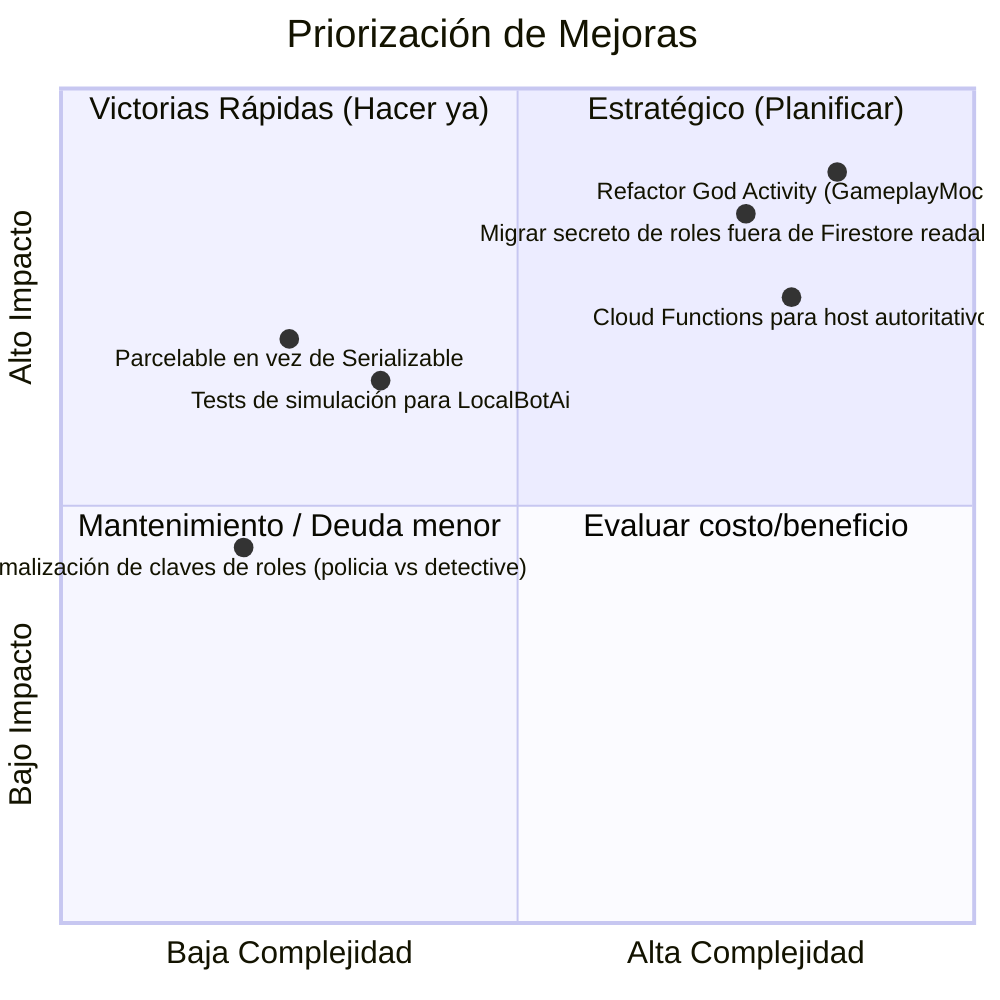

# Análisis y Feedback Técnico — App Traidores

Auditoría integral del estado actual del proyecto (arquitectura, motor de juego, IA de bots, modo online, UI/UX y testing) con recomendaciones priorizadas de mejora.

---

## 1. Diagnóstico General y Fortalezas

- **Motor de reglas sólido**: `GameEngine` cuenta con una suite extensa de pruebas unitarias (+120 tests en `GameEngineTest.kt`) y modelado claro de fases y roles.
- **Sistema de Bots con IA social**: Comportamiento conversacional reactivo a sospechas, *claims*, contraacusaciones y estilo narrativo diferenciado.
- **Identidad visual lograda**: Dirección artística y ambientación temática (Gaucha, Griega, Medieval) coherente en drawables, música y efectos.
- **Prototipo Online funcional**: Arquitectura client-host con sincronización reactiva en Firestore, *watchdogs* de conectividad y recuperación de sesión.

---

## 2. Áreas de Mejora Prioritarias

### A. Arquitectura y Código (Impacto Crítico)
1. **Descomponer "God Activity" (`GameplayMockActivity` ~6.8k líneas)**:
   - **Problema**: Concentra renderizado de mesa, listeners de Firestore, timers de bots, animaciones, overlays, chat y gestión de audio.
   - **Solución**: Extraer a componentes especializados bajo arquitectura MVVM/MVI:
     - `GameplayViewModel`: Manejo de estado inmutable (`StateFlow`/`LiveData`).
     - `OnlineSyncController`: Escucha y publicación hacia Firestore/RTDB.
     - `TableLayoutPresenter`: Posicionamiento y renderizado de cartas de jugadores.
     - `ChatController`: Panel de debate y mensajería.
2. **Migrar `Serializable` a `Parcelable` o Kotlinx Serialization**:
   - `GameSession` viaja entre Activities por `Intent` con serialización Java nativa y supresiones de deprecación (`@Suppress("DEPRECATION")`). Usar `@Parcelize` reduce overhead de memoria y tiempo de transición.
3. **Renombrar `GameplayMockActivity` a `GameplayActivity`**:
   - El sufijo "Mock" es engañoso ya que contiene la pantalla productiva real del juego.

---

### B. Modo Online y Seguridad (Impacto Alto)
1. **Protección contra *Spectator/Client Cheating***:
   - **Problema**: `partidaInicial` en Firestore contiene el reparto de roles de todos los jugadores. Si las reglas permiten lectura al participante, un usuario técnico puede inspeccionar Firestore y conocer a los traidores.
   - **Solución**: Usar Firebase Cloud Functions para distribuir a cada jugador únicamente su propio rol (subcolección privada `jugadores/{uid}/secreto`) y publicar roles solo al revelarse en el cementerio/resultado.
2. **Host Client-Authoritative vs Backend**:
   - El traspaso de host (`hostActivoId`) resuelve desconexiones entre pares, pero si el host tiene latencia o manipula tiempos locales, afecta la sincronización de todos.

---

### C. Motor de Juego e IA (Impacto Medio-Alto)
1. **Paridad de roles Local vs Online**:
   - El modo local soporta 11 roles (Payador, Bufón, Oráculo, Mercenario, etc.), mientras el online está restringido a "online seguro" (4 roles básicos). Planificar la adaptación de roles complejos para juego en red.
2. **Simulaciones automatizadas de IA**:
   - Crear tests de simulación masiva (ej. 500 partidas bot vs bot) para validar balance de victoria (Inocentes vs Traidores), ausencia de bloqueos (*deadlocks*) y coherencia en votaciones extremas.
3. **Nomenclatura unificada de roles**:
   - Homogeneizar la clave interna (`policia`), el recurso gráfico (`rol_detective_*`) y el nombre en UI (`Comisario`/`Detective`) mediante un enum tipado (`RoleType`) con mappers explícitos.

---

### D. UI, UX y Recursos (Impacto Medio)
1. **Carga y caché eficiente de Drawables**:
   - Los assets `.webp` de mapas y fondos en alta resolución pueden impactar la memoria en dispositivos de gama baja. Considerar una librería de carga de imágenes (Coil) para avatares y fondos dinámicos.
2. **Internacionalización completa**:
   - Extraer textos residuales en código hacia `strings.xml` para completar la funcionalidad del selector de idioma de `OpcionesActivity`.

---

## 3. Plan de Acción Recomendado

| Fase | Tareas Clave | Meta |
|---|---|---|
| **Fase 1: Estabilización** | • Migrar `GameSession` a `@Parcelize` • Homogeneizar enums y nombres de roles • Crear tests de integración para `LocalBotAi` | Reducir deuda técnica y blindar estabilidad |
| **Fase 2: Refactor UI** | • Separar `GameplayMockActivity` en ViewModel + Controllers • Renombrar Activity y limpiar supresiones deprecated | Mantenibilidad y escalabilidad |
| **Fase 3: Online Prod** | • Proteger roles en backend (Cloud Functions) • Habilitar roles especiales en salas multijugador • Kick/moderación de jugadores desconectados | Preparar versión para Play Store |
