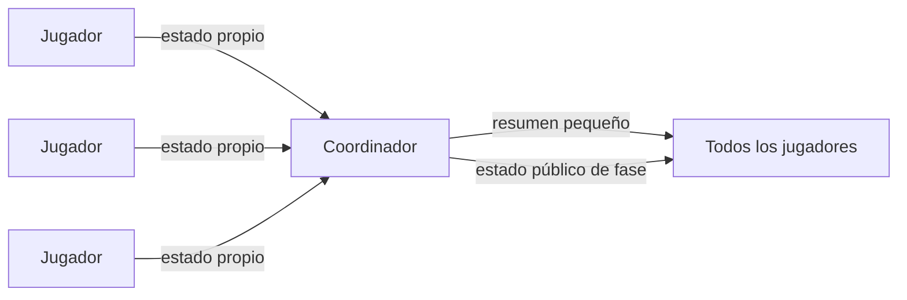

# Plan para reducir la autoridad y la carga del anfitrión en Spark

**Fecha:** 7 de septiembre de 2026  
**Base para medir:** APK `0.1.21`  
**Objetivo:** partidas estables de 5 a 15 jugadores, misma presentación para todos, menos
tráfico y menos información privada en el dispositivo que coordina la sala.

## Decisión de arquitectura

Separar tres responsabilidades que hoy se mezclan bajo la palabra «anfitrión»:

| Responsabilidad | Durante la sala | Durante la partida en Spark | Con Blaze |
|---|---|---|---|
| Dueño de la sala | Configura, modera e inicia | No tiene privilegios visuales | Igual |
| Coordinador técnico | Inicialmente el dueño | Ordena fases y recupera la partida | Backend |
| Jugador | Juega | Recibe y presenta el mismo estado que los demás | Igual |

En Spark, el coordinador seguirá siendo un teléfono. La meta es que esa condición no se note en
la experiencia: deberá consumir el mismo estado publicado, respetar la misma hora de apertura y
ver las mismas cinemáticas que los invitados.

## Límite real del plan gratuito

Se puede reducir mucho la carga del anfitrión, impedir que lea canales privados que no le
corresponden, ocultarle las acciones mientras la ventana sigue abierta y eliminar su ventaja
visual.

No se puede impedir por completo que un APK anfitrión modificado conozca los roles o fabrique un
resultado mientras ese teléfono ejecute `GameEngine`. El código actual exige que el anfitrión
cargue todos los repartos para resolver la partida. La eliminación completa de esa confianza
requiere que el reparto y la resolución vivan en un servidor autoritativo.

No conviene rotar la autoridad entre teléfonos ni implementar un reparto criptográfico entre
jugadores antes del lanzamiento. Agregaría carreras, reconexiones difíciles de recuperar y más
puntos de fallo, sin ofrecer la garantía de un backend.

## Hallazgos que guían el orden

1. Todos los clientes escuchan actualmente el árbol completo
   `sincronizacion/clientes` y `sincronizacion/listosVotacion`. Cada jugador publica un pulso
   cada diez segundos. Un `ValueEventListener` en el padre vuelve a entregar el conjunto, por lo
   que el tráfico crece con rapidez al pasar de 5 a 12 o 15 jugadores.
2. El anfitrión mantiene un listener de todas las acciones durante la fase y después hace otra
   lectura de servidor para resolver. Esto duplica trabajo y le entrega información antes del
   cierre.
3. La regla `.read` de `salas/$roomId` concede al anfitrión lectura de todo el árbol RTDB. En
   RTDB, un permiso concedido en un padre no puede retirarse en sus hijos; por eso las reglas más
   estrictas de `chat_traidores` y `chat_espectadores` no ocultan esos canales al anfitrión.
4. Al iniciar, el anfitrión asigna y carga todos los repartos privados. Esta información es
   necesaria para el motor actual y no debe prometerse como resuelta dentro de Spark.
5. Ya existen una medición de bytes de la aplicación, métricas de sincronización y un estimador
   de lecturas de Firestore. Falta reunirlos en un reporte persistente por partida y distinguir
   cada canal.

## Etapa 0 — Instrumentación sin cambiar el juego

Crear una compilación dedicada a medir la arquitectura actual antes de optimizarla. Debe conservar
la lógica de `0.1.21`.

- Asignar un identificador corto de prueba y registrar versión, anfitrión/invitado, cantidad de
  jugadores, duración, rondas y reconexiones.
- Incluir en «COPIAR REPORTE BETA» los bytes recibidos y enviados por el UID de Android y el
  resumen de `OnlineFirestoreUsageCounter` del lobby y del gameplay.
- Contar mensajes y estimar bytes por canal: estado autoritativo, sincronización de clientes,
  presencia, listos, chat, acciones y repartos. Esta estimación sirve para atribuir tráfico; la
  consola de Firebase seguirá siendo la medida de facturación.
- Guardar el cierre de la medición al volver al lobby para que no se pierda al destruir la
  Activity.
- No guardar nombres, mensajes, roles ni UID completos.

**Salida:** un reporte del anfitrión y al menos uno de invitado que puedan compararse con los
totales de RTDB y Firestore de la consola.

## Etapa 1 — Quitar información innecesaria

1. Eliminar el permiso de lectura del padre `salas/$roomId` y conservar permisos explícitos por
   cada hijo.
2. Auditar que el cliente sólo lea las rutas que usa. El anfitrión podrá leer membresía,
   presencia, coordinación y estado público; los chats secretos sólo serán visibles para el rol
   habilitado.
3. Dejar de escuchar todas las acciones en el anfitrión. Cada jugador observará únicamente la
   confirmación de su propia acción.
4. Permitir al coordinador consultar las acciones únicamente cuando la ventana ya esté cerrada y
   sólo para el `matchId` y `phaseIndex` actuales. Las reglas deberán aplicar la misma condición.
5. Borrar las acciones de la fase después de guardar el checkpoint, sin bloquear la presentación
   si la limpieza falla.
6. Agregar pruebas de reglas que demuestren que un anfitrión aldeano no puede leer chat de
   traidores, chat de muertos ni acciones abiertas.

**Resultado esperado:** el anfitrión deja de ver chats que no le corresponden y no recibe votos o
decisiones nocturnas en tiempo real. Seguirá conociendo el reparto completo por la limitación del
motor en Spark.

## Etapa 2 — Reducir el tráfico de sincronización

1. Cambiar los listeners de colecciones RTDB de `ValueEventListener` a eventos por hijo, para que
   una actualización no vuelva a descargar el conjunto completo.
2. Sólo el coordinador escuchará los estados individuales de todos los jugadores.
3. El coordinador publicará un resumen pequeño por fase: jugadores cargados, presentaciones
   confirmadas, listos y regresos al lobby. Los invitados escucharán ese resumen y su estado
   propio.
4. Mantener publicaciones completas sólo cuando cambia un dato semántico. El pulso modificará
   únicamente el timestamp y su intervalo se ajustará después de observar la línea base.
5. Mantener presencia fuera del estado del juego. Una reconexión publicará inmediatamente; no se
   usará una escritura grande como pulso.

El flujo pasa de difundir el estado individual de todos a todos a esta forma:

**Resultado esperado:** el tráfico de los invitados deja de crecer por cada pulso de cada otro
jugador; el coordinador recibe cambios individuales en lugar de árboles completos.

## Etapa 3 — Igualar al anfitrión en la presentación

1. Separar el cálculo de una transición de su presentación visual.
2. El coordinador calcula, guarda y publica `{authorityEpoch, sequence, presentationId,
   revealAt}`.
3. El propio coordinador no aplica directamente el resultado calculado. Lo recibe por el mismo
   canal autoritativo que los invitados y lo coloca en la misma cola visual.
4. Cada dispositivo conserva completas las cinemáticas esenciales. Si el próximo estado llega
   temprano, espera en la cola; no interrumpe inicio, amanecer, muerte, expulsión ni victoria.
5. `authorityEpoch + sequence` reemplaza cualquier comparación basada en el reloj local para
   aceptar o descartar estados.

**Resultado esperado:** el anfitrión puede publicar primero porque coordina, pero no ve ni puede
accionar sobre el resultado antes que los demás desde la aplicación normal.

## Etapa 4 — Reducir Firestore sin perder recuperación

Esta etapa se decide con las mediciones de las anteriores.

- Evaluar mover votos, acciones nocturnas y listos a bandejas RTDB por jugador, con ID
  idempotente y lectura global exclusiva del coordinador después del cierre.
- Conservar en Firestore sólo checkpoints de fase, reparto privado, membresía y resultado final.
- No escribir estado de presencia ni pulsos en Firestore.
- Mantener una ruta de recuperación para que un coordinador nuevo reconstruya la fase desde el
  último checkpoint y las acciones cerradas.

La migración de acciones sólo se hará si las métricas muestran que las operaciones de Firestore
son una parte material del consumo. Cambiar de base antes de medir agregaría riesgo sin evidencia.

## Medición base y comparación

Orden de pruebas:

1. Una partida de 5 jugadores con `0.1.21` o con la compilación de instrumentación sin cambios de
   lógica.
2. Una partida de 12 jugadores.
3. Una partida de 15 jugadores.
4. Repetir una prueba con un invitado lento y otra desconectando al coordinador.
5. Repetir las mismas pruebas después de cada etapa, con duración y cantidad de rondas parecidas.

Por cada prueba se deben conservar:

- reporte beta del anfitrión y de dos invitados;
- bytes enviados/recibidos por dispositivo;
- lecturas y escrituras estimadas por flujo;
- total diario de descargas RTDB y operaciones Firestore antes y después de la ventana de prueba;
- latencia de publicación, diferencia de inicio de presentación y cantidad de reconexiones;
- resultado funcional: animaciones completas, orden de fases y vuelta conjunta al lobby.

Las cifras locales permiten saber qué flujo consumió. La consola de Firebase permite saber qué
se facturó o descontó de la cuota. Se necesitan ambas.

## Criterio para avanzar

| Paso | Condición mínima |
|---|---|
| Medición base | Reportes válidos del anfitrión y de invitados en 5 y 12 jugadores |
| Etapa 1 | Ningún acceso indebido en pruebas de reglas y partida completa sin rechazo de permisos |
| Etapa 2 | Menos bytes por invitado y crecimiento aproximadamente lineal al pasar de 5 a 15 |
| Etapa 3 | Ninguna cinemática esencial cortada y sin ventaja visual reproducible del anfitrión |
| Etapa 4 | Sólo si reduce una fuente de consumo que la medición confirmó como relevante |
| Producción | Tres partidas consecutivas de 5, 12 y 15 sin bloqueo, pérdida de fase ni regreso parcial |

## Migración futura a Blaze

La separación propuesta permite reemplazar únicamente al coordinador:

- el backend asigna roles y entrega a cada jugador sólo su reparto;
- recibe acciones, valida ventanas y resuelve fases;
- publica `authorityEpoch`, `sequence` y el estado público;
- registra resultado y estadísticas una sola vez;
- el creador de la sala queda como moderador, sin conocer roles ajenos ni controlar el motor.

La UI, la cola de presentaciones, los reportes y casi todos los canales creados en Spark se
conservan. Así, el trabajo del plan gratuito no se descarta al pasar a Blaze.

## Orden recomendado de ejecución

1. Terminar el test funcional de `0.1.21`.
2. Crear la compilación de instrumentación y tomar la línea base.
3. Aplicar juntas las restricciones de lectura y la eliminación del listener anticipado de
   acciones.
4. Cambiar la topología de sincronización y volver a medir.
5. Igualar la ruta visual del coordinador y hacer las pruebas de 5, 12 y 15 jugadores.
6. Decidir con datos si conviene migrar acciones de Firestore a RTDB.

